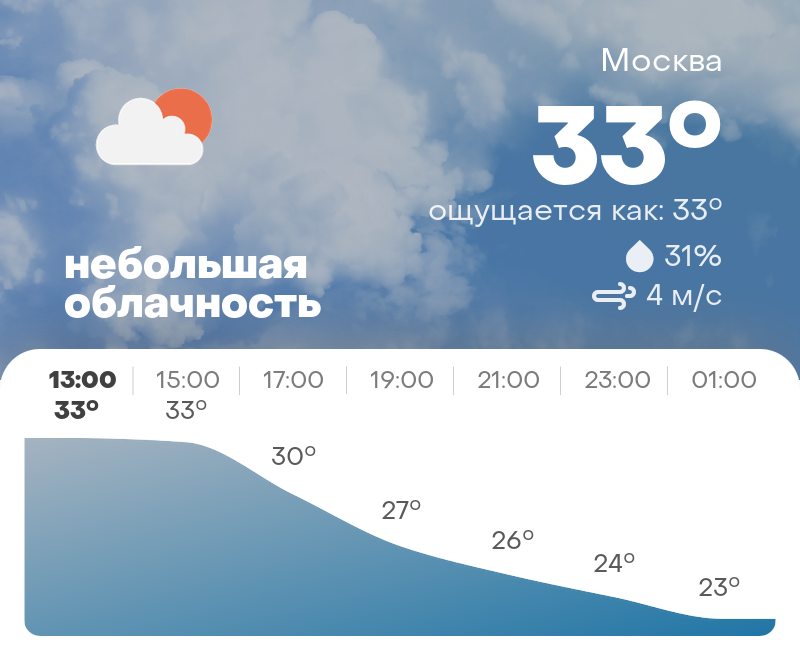
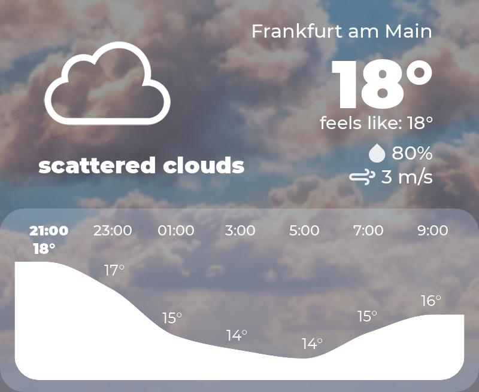
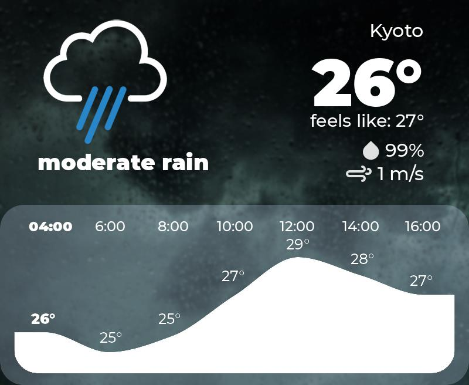

<h1 style="text-align: center;">VWapi</h1>

Visual Weather api. Returns beautiful pictures with the current weather.





# Installation:

```
sudo apt update -y && sudo apt upgrade -y
sudo apt install -y git python3 python3-pip 
git clone https://github.com/mishailovic/VWapi
cd VWapi
pip3 install -r requirements.txt
python3 -m uvicorn weatherapi:app --reload
```

# Usage:

```
import requests
import time
language = "en" # can be "en" or "ru"
place = Moscow # can be any city, place, street, or ышеу, geocoder automatically selects location. 
timestamp = round(time()) # optional timestamp, can be any unix timestamp from now to now + plus three days 
r = requests.get(f"https://weather.hotaru.ga/{language}{city}{place}?timestamp={timestamp}")
```
Now r.content is an image containing weather for Moscow in English language for the current time.

# Credits:
Most of the code ~~stolen~~ taken from https://github.com/adrian-kalinin/TeleWeatherRobot huge thanks to its developer @adrian-kalinin


