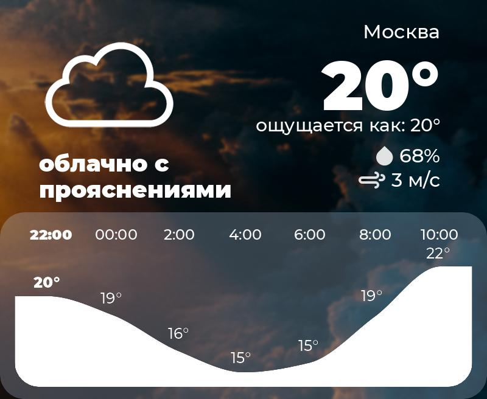

<h1 style="text-align: center;">VWapi</h1>

Visual Weather api. Returns beautiful pictures with the current weather.




# Installation:

```
sudo apt update -y && sudo apt upgrade -y
sudo apt install -y git python3 python3-pip 
git clone https://github.com/mishailovic/VWapi
cd VWapi
pip3 install -r requirements.txt
python3 -m uvicorn weatherapi:app --reload
```

# Usage:

```
wget localhost:8000/en/Moscow
```
Will download forecast in .jpg format.

# Credits:
Most of the code ~~stolen~~ taken from https://github.com/adrian-kalinin/TeleWeatherRobot huge thanks to its developer @adrian-kalinin


